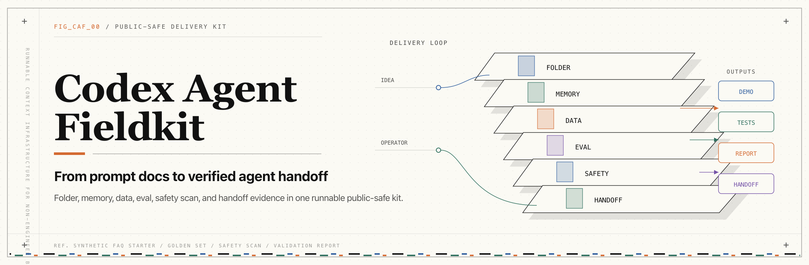

# Codex Agent Fieldkit

Language: [English](#codex-agent-fieldkit) | [한국어](#한국어-readme)



[](https://github.com/kimsanguine/codex-agent-fieldkit/actions/workflows/ci.yml)


> A runnable Codex agent delivery fieldkit for non-engineers: starter code, project memory, evals, safety scans, and handoff artifacts in one public-safe folder.

Not a prompt collection. Not an agent framework. Not a slide archive.

Codex Agent Fieldkit gives product managers, operators, and corporate AI teams a practical path from idea to a working, inspectable starter agent:

## Proof Snapshot

- **No API key:** the starter demo runs locally with Python standard library code and synthetic data.
- **Offline runnable:** `make demo`, `make test`, `make eval`, and `make validate` work from the repo root.
- **Eval evidence:** 20/20 golden-set eval and 6 unit tests are recorded in the starter validation log.
- **Safety evidence:** public-first scans cover secret-like strings, private terms, PII, public links, generated artifacts, and gitleaks.
- **Report evidence:** `make validate-report` writes a shareable validation report and CI uploads it as an artifact.
- **Release evidence:** CI/gitleaks green was recorded in the 2026-06-22 public release audit.

This is not production certification. It is a public-safe delivery kit for learning, adaptation, validation practice, and handoff.

## 15-Minute Operator Loop

```bash
git clone https://github.com/kimsanguine/codex-agent-fieldkit.git
cd codex-agent-fieldkit
make demo
make validate
make validate-report
```

Outputs:

- sourced synthetic FAQ answer
- unit tests and golden-set eval
- public-safe scans
- [`reports/validation.md`](reports/validation.md)

## Visual Proof

- Hero image: [`assets/images/banner.png`](assets/images/banner.png)
- Intro video: [`assets/video/codex-agent-fieldkit-intro.mp4`](assets/video/codex-agent-fieldkit-intro.mp4)
- Remotion source: [`media/fieldkit-intro-video/`](media/fieldkit-intro-video/)

## Who Should Star This?

- PMs and operators who need a runnable first agent folder, not a prompt document.
- Corporate AI, AX, and L&D leads who need a safe non-engineer workshop kit with dummy data boundaries.
- Engineers helping non-engineers bring tests, evals, validation logs, and handoff notes before implementation review.
- Builders comparing Codex workflows who want a small repo that proves the delivery loop end to end.

## How It Works

1. Open the right project folder in Codex.
2. Give Codex project memory through `AGENTS.md`.
3. Adapt a runnable starter agent with synthetic data.
4. Run tests, evals, and public-release scans.
5. Capture validation evidence.
6. Package the work for a safe handoff.

This project is **unofficial** and is not affiliated with OpenAI. All examples are fictional or synthetic.

## Why This Exists

Most AI agent guides stop at prompts. In real non-engineer workflows, the hard part is the operating system around the prompt:

- folder structure
- project instructions
- dummy data boundaries
- env and secret handling
- golden-set tests
- validation logs
- handoff notes
- release audit

This repo turns those practices into a small runnable kit.

## Not Another Agent Framework

| If you are looking for... | This repo gives you... |
|---|---|
| A prompt library | A runnable starter agent plus tests, evals, safety scans, and handoff docs |
| A new orchestration framework | A simple offline delivery path that can later be adapted to your chosen stack |
| A production customer-service template | A public-safe starter kit with explicit limits and verification artifacts |

## Quickstart

Run the starter kit without an API key:

```bash
git clone https://github.com/kimsanguine/codex-agent-fieldkit.git
cd codex-agent-fieldkit
make setup
make demo
make test
make eval
make validate
make validate-report
```

Expected result:

- `make demo` answers sample customer questions from synthetic FAQs.
- `make eval` checks the agent against a golden set.
- `make validate` runs tests, evals, and public-release safety scans.
- `make validate-report` writes a shareable report for review or CI artifact upload.

Sample output:

```text
Q: Can I change my billing date?
A: Yes. In this fictional ACME Life sample, customers can request one billing-date change per month before the next invoice is issued.
Source: FAQ-001 | Category: billing | Confidence: 1.00
Handoff: Owner: billing operations. Check policy before using in production.
```

## The 60-Minute Codex Path

| Time | Outcome | File |
|---:|---|---|
| 0-5 min | Understand the fieldkit | [`START_HERE.md`](START_HERE.md) |
| 5-12 min | Install and sign in to Codex | [`docs/codex/01-install-login-health-check.md`](docs/codex/01-install-login-health-check.md) |
| 12-20 min | Open the correct folder | [`docs/codex/02-open-the-right-folder.md`](docs/codex/02-open-the-right-folder.md) |
| 20-30 min | Let Codex inspect before editing | [`docs/codex/03-inspect-before-edit.md`](docs/codex/03-inspect-before-edit.md) |
| 30-42 min | Adapt the starter agent | [`starter-kits/faq-agent-lite/`](starter-kits/faq-agent-lite/) |
| 42-50 min | Run tests and evals | [`docs/codex/08-golden-set-and-test-cases.md`](docs/codex/08-golden-set-and-test-cases.md) |
| 50-56 min | Run release checks | [`docs/release-audit/public-release-checklist.md`](docs/release-audit/public-release-checklist.md) |
| 56-60 min | Prepare handoff | [`docs/codex/10-handoff-package.md`](docs/codex/10-handoff-package.md) |

For a complete narrated adaptation example, see [`examples/adaptation-walkthrough.md`](examples/adaptation-walkthrough.md).

For Korean PM/product leaders, see [`docs/ko/pm-leader-guide.md`](docs/ko/pm-leader-guide.md).

## Audience Paths

| Audience | Start here |
|---|---|
| Non-engineer operators | [`START_HERE_FOR_OPERATORS.md`](START_HERE_FOR_OPERATORS.md) |
| Korean insurance or service operators | [`START_HERE_FOR_INSURANCE_OPERATORS.md`](START_HERE_FOR_INSURANCE_OPERATORS.md) |
| PM/CPO or enterprise reviewer | [`docs/production-bridge.md`](docs/production-bridge.md) |
| Insurance or service operations practitioner | [`docs/adapt-for-insurance-ops.md`](docs/adapt-for-insurance-ops.md) |
| Workshop facilitator | [`docs/workshop-pack/`](docs/workshop-pack/) |
| Enterprise IT / enablement owner | [`docs/enterprise-it-preflight.md`](docs/enterprise-it-preflight.md) |
| Developer adding a new starter kit | [`docs/add-a-starter-kit.md`](docs/add-a-starter-kit.md) |
| Open-source curator | [`docs/launch/awesome-list-entry.md`](docs/launch/awesome-list-entry.md) |

## What's Included

```text
.
├── START_HERE.md
├── START_HERE_FOR_OPERATORS.md
├── START_HERE_FOR_INSURANCE_OPERATORS.md
├── assets/
│   ├── images/                # README hero image
│   └── video/                 # rendered intro video
├── starter-kits/
│   ├── faq-agent-lite/        # runnable offline starter agent
│   └── _template/             # starter-kit contract for future kits
├── docs/
│   ├── codex/                 # Codex workflow for non-engineers
│   ├── workshop-pack/         # facilitator and learner materials
│   ├── templates/             # signoff, data inventory, handoff checklists
│   ├── adapt-for-insurance-ops.md
│   ├── enterprise-it-preflight.md
│   ├── add-a-starter-kit.md
│   ├── production-bridge.md
│   ├── public-first-safety/   # anonymization and data policy
│   ├── release-audit/         # public release checklist
│   ├── rubrics/               # quality scorecard
│   └── launch/                # public launch copy
├── examples/
│   └── insurance-ops-pack/    # synthetic insurance adaptation pack
├── media/
│   └── fieldkit-intro-video/  # Remotion source
├── reports/
│   └── validation.md          # generated by make validate-report
├── scripts/                   # repo-level safety checks
├── tests/                     # repo-level private-term checks
└── .agents/skills/            # optional repo-scoped Codex skill
```

## Starter Kit

The first starter kit is intentionally narrow:

[`starter-kits/faq-agent-lite`](starter-kits/faq-agent-lite/)

It is a retrieval-style FAQ agent that uses only Python standard library code and synthetic data. It is designed for PMs and operators to inspect, change, test, and hand off.

Commands:

```bash
make setup
make demo
make test
make eval
make validate
make validate-report
```

## Quality Gate

Before publishing or adapting this kit to a real organization, run:

```bash
make validate
```

The validation gate checks:

- Python tests
- golden-set evals
- secret-like strings
- private/client terms
- PII-like strings
- unsafe public links
- generated local artifacts
- optional local gitleaks wrapper, with GitHub Actions gitleaks scan in CI
- handoff and validation-log presence

For the scoring rubric, see [`docs/rubrics/agent-fieldkit-scorecard.md`](docs/rubrics/agent-fieldkit-scorecard.md).
For eval depth, see [`docs/eval-maturity-guide.md`](docs/eval-maturity-guide.md).

## Public-First Safety

The repo is built around one rule:

> A public example must be safe before it is impressive.

Never publish:

- real client or company names from private engagements
- participant names, group numbers, scores, submissions, or screenshots
- internal URLs, QR codes, workspace links, or private repo links
- `.env` files, API keys, access tokens, logs, or local config
- real customer data, real policy data, or proprietary workflows

Use fictional examples such as `ACME Life` and synthetic sample data.

## Codex References

This fieldkit follows the current public Codex docs:

- Codex CLI can run locally in a selected directory and inspect, edit, and run code: <https://developers.openai.com/codex/cli>
- Codex app supports parallel threads, worktrees, automations, and Git workflows: <https://developers.openai.com/codex/app>
- Codex skills package reusable instructions, resources, and optional scripts: <https://developers.openai.com/codex/skills>

## Repository Relationship

Recommended public positioning:

- `AI_PM`: broad AI PM operating system and strategy hub
- `ai-prompts-playbook`: reusable prompt cards
- `codex-agent-fieldkit`: runnable Codex agent build, verification, and handoff kit

## 한국어 README

[English](#codex-agent-fieldkit) | 한국어

> 비개발자를 위한 실행 가능한 Codex agent delivery fieldkit입니다. starter code, project memory, eval, safety scan, validation report, handoff artifact를 하나의 public-safe 폴더로 제공합니다.

프롬프트 모음이 아닙니다. 새로운 agent framework도 아닙니다. 강의 슬라이드 아카이브도 아닙니다.

Codex Agent Fieldkit은 PM, 운영자, 기업 AI/AX/L&D 팀이 아이디어를 작동하고 검증 가능한 starter agent로 바꾸는 과정을 보여줍니다.

### 증거 스냅샷

- **API key 불필요:** starter demo는 Python 표준 라이브러리와 합성 데이터만으로 로컬에서 실행됩니다.
- **오프라인 실행 가능:** repo root에서 `make demo`, `make test`, `make eval`, `make validate`를 실행할 수 있습니다.
- **Eval 증거:** starter validation log에 20/20 golden-set eval과 6개 unit tests가 기록되어 있습니다.
- **Safety 증거:** secret-like string, private term, PII, public link, generated artifact, gitleaks 검사를 포함합니다.
- **Report 증거:** `make validate-report`가 공유 가능한 validation report를 생성하고, CI가 artifact로 업로드합니다.

이 repo는 production certification이 아닙니다. 학습, 적응, 검증 연습, 인수인계를 위한 public-safe delivery kit입니다.

### 15분 운영자 루프

```bash
git clone https://github.com/kimsanguine/codex-agent-fieldkit.git
cd codex-agent-fieldkit
make demo
make validate
make validate-report
```

결과:

- 출처가 붙은 합성 FAQ 답변
- unit tests와 golden-set eval
- public-safe scans
- [`reports/validation.md`](reports/validation.md)

### 시각 자료

- Hero image: [`assets/images/banner.png`](assets/images/banner.png)
- Intro video: [`assets/video/codex-agent-fieldkit-intro.mp4`](assets/video/codex-agent-fieldkit-intro.mp4)
- Remotion source: [`media/fieldkit-intro-video/`](media/fieldkit-intro-video/)

### 누가 보면 좋은가

- prompt 문서가 아니라 실행 가능한 첫 agent 폴더가 필요한 PM/운영자
- dummy data boundary가 있는 비개발자 워크숍 kit이 필요한 기업 AI, AX, L&D 담당자
- 비개발자가 구현 리뷰 전에 test, eval, validation log, handoff를 갖추게 돕고 싶은 엔지니어
- Codex workflow를 end-to-end로 증명하는 작은 repo를 찾는 builder

### 작동 방식

1. Codex에서 올바른 project folder를 엽니다.
2. `AGENTS.md`로 Codex에게 project memory를 제공합니다.
3. 합성 데이터로 runnable starter agent를 수정합니다.
4. tests, evals, public-release scans를 실행합니다.
5. validation evidence를 기록합니다.
6. 안전한 handoff package로 넘깁니다.

이 프로젝트는 **unofficial**이며 OpenAI와 제휴되어 있지 않습니다. 모든 예시는 fictional 또는 synthetic입니다.

### 왜 만들었나

대부분의 AI agent guide는 prompt에서 멈춥니다. 하지만 실제 비개발자 workflow에서 어려운 것은 prompt 주변의 운영체계입니다.

- folder structure
- project instructions
- dummy data boundaries
- env and secret handling
- golden-set tests
- validation logs
- handoff notes
- release audit

이 repo는 그 운영 방식을 작은 runnable kit으로 바꿉니다.

### Quickstart

API key 없이 starter kit을 실행합니다.

```bash
git clone https://github.com/kimsanguine/codex-agent-fieldkit.git
cd codex-agent-fieldkit
make setup
make demo
make test
make eval
make validate
make validate-report
```

기대 결과:

- `make demo`는 합성 FAQ에서 sample customer question에 답합니다.
- `make eval`은 agent를 golden set 기준으로 확인합니다.
- `make validate`는 tests, evals, public-release safety scans를 실행합니다.
- `make validate-report`는 review 또는 CI artifact용 report를 생성합니다.

### Audience Paths

| 대상 | 시작점 |
|---|---|
| 비개발자 운영자 | [`START_HERE_FOR_OPERATORS.md`](START_HERE_FOR_OPERATORS.md) |
| 한국어 보험/서비스 운영자 | [`START_HERE_FOR_INSURANCE_OPERATORS.md`](START_HERE_FOR_INSURANCE_OPERATORS.md) |
| PM/CPO 또는 enterprise reviewer | [`docs/production-bridge.md`](docs/production-bridge.md) |
| 보험/서비스 운영 practitioner | [`docs/adapt-for-insurance-ops.md`](docs/adapt-for-insurance-ops.md) |
| 워크숍 facilitator | [`docs/workshop-pack/`](docs/workshop-pack/) |
| Enterprise IT / enablement owner | [`docs/enterprise-it-preflight.md`](docs/enterprise-it-preflight.md) |
| 새 starter kit을 추가하는 developer | [`docs/add-a-starter-kit.md`](docs/add-a-starter-kit.md) |
| Open-source curator | [`docs/launch/awesome-list-entry.md`](docs/launch/awesome-list-entry.md) |

### 포함된 것

```text
.
├── START_HERE.md
├── START_HERE_FOR_OPERATORS.md
├── START_HERE_FOR_INSURANCE_OPERATORS.md
├── assets/
│   ├── images/                # README hero image
│   └── video/                 # rendered intro video
├── starter-kits/
│   ├── faq-agent-lite/        # runnable offline starter agent
│   └── _template/             # starter-kit contract for future kits
├── docs/
│   ├── codex/                 # Codex workflow for non-engineers
│   ├── workshop-pack/         # facilitator and learner materials
│   ├── templates/             # signoff, data inventory, handoff checklists
│   ├── adapt-for-insurance-ops.md
│   ├── enterprise-it-preflight.md
│   ├── add-a-starter-kit.md
│   ├── production-bridge.md
│   ├── public-first-safety/
│   ├── release-audit/
│   ├── rubrics/
│   └── launch/
├── examples/
│   └── insurance-ops-pack/
├── media/
│   └── fieldkit-intro-video/
├── reports/
│   └── validation.md
├── scripts/
├── tests/
└── .agents/skills/
```

### Quality Gate

공개하거나 실제 조직에 맞게 수정하기 전에 다음 명령을 실행합니다.

```bash
make validate
```

검증 항목:

- Python tests
- golden-set evals
- secret-like strings
- private/client terms
- PII-like strings
- unsafe public links
- generated local artifacts
- optional local gitleaks wrapper, plus GitHub Actions gitleaks scan in CI
- handoff and validation-log presence

Scoring rubric은 [`docs/rubrics/agent-fieldkit-scorecard.md`](docs/rubrics/agent-fieldkit-scorecard.md)를 참고하세요. Eval maturity는 [`docs/eval-maturity-guide.md`](docs/eval-maturity-guide.md)에 정리되어 있습니다.

### Public-First Safety

이 repo의 핵심 원칙은 하나입니다.

> Public example은 impressive하기 전에 safe해야 합니다.

공개 repo에 넣지 말아야 할 것:

- private engagement의 실제 client/company name
- participant name, group number, score, submission, screenshot
- internal URL, QR code, workspace link, private repo link
- `.env` file, API key, access token, log, local config
- real customer data, real policy data, proprietary workflow

`ACME Life` 같은 fictional example과 synthetic sample data를 사용하세요.

## License

MIT. See [`LICENSE`](LICENSE).
